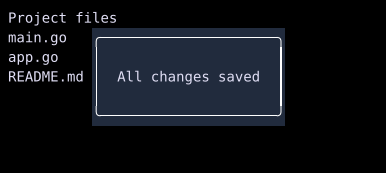

# Floating

`Floating` displays a child as an overlay above the main widget tree.



## [Example](widgets/index.md#run-an-example)

```go
--8<-- "docs/widget-examples/layout/examples.go:floating"
```

## Behavior

- `Visible` controls whether the float registers for rendering.
- The float contributes no space to its parent layout.
- Without `Config.AnchorID`, `Config.Position` selects a screen position and `Config.Offset` adjusts it in cells.
- Positions include the center and the top or bottom at left, center, or right.
- `FloatPositionAbsolute` is the default and uses `Config.Offset` as screen coordinates.
- With `Config.AnchorID`, `Config.Anchor` places the overlay relative to that widget.
- `AnchorBottomLeft` requests placement below the anchor, aligned with its left edge.
- The renderer clamps the final position to keep the overlay on screen.
- Other anchor points place it above, below, left, or right, with edge or center alignment.
- `Config.Modal: true` adds a backdrop, blocks pointer input to underlying content, and confines Tab navigation to the overlay.
- A modal focuses its first focusable child when focus is outside it, unless a pending `RequestFocus` targets another child inside it.
- `Config.BackdropColor` overrides the default translucent black backdrop.
- `Config.OnDismiss` receives dismissal requests. Its callback must update the state that controls `Visible` to hide the overlay.
- Escape dismissal defaults to enabled when `Config.OnDismiss` is set.
- Outside-click dismissal defaults to enabled for non-modal floats with `Config.OnDismiss`.
- `Config.DismissOnEsc` and `Config.DismissOnClickOutside` override those defaults.
- `Config.PointerPassthrough: true` lets mouse input reach content beneath the overlay and skips outside-click dismissal.
- Modal behavior takes precedence over pointer passthrough.
- Pointer passthrough does not disable keyboard focus or Escape dismissal.

## Geometry-aware content

```go
--8<-- "docs/widget-examples/layout/examples.go:floating-geometry"
```

- `BuildChild` takes precedence over `Child` and runs after the main tree has been laid out.
- Its `FloatGeometry` contains screen bounds, anchor bounds, clipped visible anchor bounds, and an `AnchorFound` flag.
- Anchor bounds include padding and border but exclude margin.
- A missing anchor has `AnchorFound == false` and zero anchor rectangles.
- Returning nil produces empty content.
- Signal reads in `BuildChild` subscribe to updates.
- The callback must not mutate signals.
- Only the main tree and earlier overlays are available as anchors.

## Shadows and glows

`Config.Shadow` adds a customizable effect around any floating widget. Nil keeps the existing appearance without a shadow.

```go
FloatConfig{
	Shadow: &FloatShadow{
		Color:      Black.WithAlpha(0.45),
		Offset:     Offset{X: 1, Y: 1},
		BlurRadius: 2,
		Spread:     1,
	},
}
```

- `Color` sets the tint and opacity. A transparent color disables the effect.
- `Offset` shifts the shadow in terminal cells. A zero offset gives a glow around the widget.
- `Spread` expands the solid part of the effect. `BlurRadius` controls its fading edge. Negative values are treated as zero.
- The effect blends with existing text and background colors. It preserves glyphs and links beneath it.
- Shadow cells do not change layout, anchor geometry, or pointer hit areas.

[Draggable](drag-and-drop.md) and tab headers use the same effect while floating.

## Related

- [Tooltip](widgets/tooltip.md)
- [Toasts](widgets/toast.md)
- [FocusTrap](widgets/focustrap.md)
