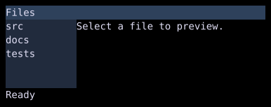

# Dock

`Dock` places children at the edges and gives `Body` the remaining space.



## [Example](../widgets/index.md#run-an-example)

```go
--8<-- "docs/widget-examples/layout/examples.go:dock"
```

## Behavior

- `Top`, `Bottom`, `Left`, and `Right` each accept a slice of widgets.
- The default `DockOrder` is `Top`, `Bottom`, `Left`, then `Right`.
- Each edge consumes space before the next edge is laid out.
- When left and right edges come first, their children receive the full available height.
- Multiple top or bottom children stack vertically, while multiple left or right children stack horizontally.
- An unset width or height defaults to `Flex(1)`.
- `Style` supplies dimensions, padding, border, margin, and colors.

## Related

- [Row and Column](row-column.md)
