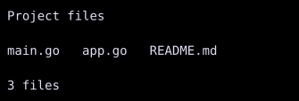

# Row and Column

`Row` arranges children horizontally, and `Column` arranges children vertically.



## [Example](../widgets/index.md#run-an-example)

```go
--8<-- "docs/widget-examples/layout/examples.go:row-column"
```

## Behavior

- `Children` contains the widgets in display order.
- `Spacing` adds a gap in cells between children.
- `MainAlign` accepts `MainAxisStart`, `MainAxisCenter`, or `MainAxisEnd` to position the group along its main axis.
- The main axis is horizontal for `Row` and vertical for `Column`.
- `CrossAlign` positions children on the other axis with `CrossAxisStart`, `CrossAxisCenter`, `CrossAxisEnd`, or `CrossAxisStretch`.
- Both alignments default to their start values.
- An explicit `Auto` width or height keeps a nested `Row` or `Column` content-sized on that axis when the parent uses `CrossAxisStretch`.
- `Style.Width` and `Style.Height` set the container dimensions.
- A bare `Spacer{}` expands along the main axis without stretching the other axis.

## Related

- [Spacer](spacer.md)
- [Dock](dock.md)
