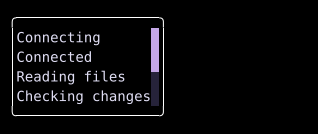

# Scrollable

`Scrollable` displays a child through a viewport with vertical and horizontal scroll offsets.



## [Example](../widgets/index.md#run-an-example)

```go
--8<-- "docs/widget-examples/layout/examples.go:scrollable"
```

## Behavior

- `State` holds the scroll position and is created with `NewScrollState()`.
- Retain the same state across `Build()` calls so scrolling does not reset when another signal changes.
- The example keeps seven log lines inside a four-line content area.
- `Focusable: true` enables keyboard focus unless `DisableFocus` or `DisableScroll` is set.
- Arrow keys scroll one cell, and `h`, `j`, `k`, and `l` provide the corresponding left, down, up, and right controls.
- Page Up and Page Down scroll by the viewport height.
- Home and End move to the top and bottom.
- The vertical scrollbar supports dragging its thumb.
- `DisableScroll` disables scrolling and hides the scrollbar.
- With `State.PinToBottom` enabled, content growth follows the bottom while the state remains pinned.
- Scrolling up breaks that pin, and scrolling back to the bottom restores it.
- `ScrollToView(y, height)` adjusts the offset to reveal a vertical region of the child.

## Related

- [Column](row-column.md)
- [List](../widgets/list.md)
