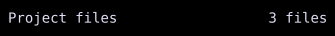

# Spacer

`Spacer` occupies layout space without drawing content.



## [Example](../widgets/index.md#run-an-example)

```go
--8<-- "docs/widget-examples/layout/examples.go:spacer"
```

## Behavior

- A bare `Spacer{}` expands horizontally in a `Row` and vertically in a `Column`.
- Outside those containers, both unset dimensions resolve to `Flex(1)`.
- `Width: Cells(n)` or `Height: Cells(n)` creates a fixed gap on that axis.
- When one dimension is set, the other defaults to `Auto`.
- An `Auto` dimension measures zero because the spacer has no content.
- `MinWidth`, `MaxWidth`, `MinHeight`, and `MaxHeight` constrain the gap.

## Related

- [Row and Column](row-column.md)
