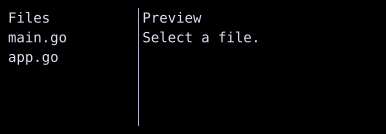

# SplitPane

`SplitPane` divides space between two children with a draggable divider.



## [Example](../widgets/index.md#run-an-example)

```go
--8<-- "docs/widget-examples/layout/examples.go:splitpane"
```

## Behavior

- `First` and `Second` supply the panes, and `State` stores the divider position.
- Retain the same state across `Build()` calls to preserve the divider position.
- `NewSplitPaneState(0.35)` gives the first pane 35% of the space available after the divider, subject to minimum pane sizes.
- Initial positions outside the open interval from 0 to 1 fall back to 0.5.
- `SplitHorizontal` places the panes side by side and is the default.
- `SplitVertical` places the first pane above the second.
- With `SplitHorizontal`, Left and Right, or `h` and `l`, change the divider position in steps of 0.05.
- With `SplitVertical`, Up and Down change the position by the same amount.
- `DividerSize` and `MinPaneSize` both default to one cell.
- Unset width and height both default to `Flex(1)`.
- `DisableFocus` removes the divider from keyboard focus and disables its resize keybindings.
- When focus is enabled and `OnExitFocus` is set, Escape calls it.
- `DividerChar` and the divider color fields customize its appearance.

## Related

- [Row and Column](row-column.md)
