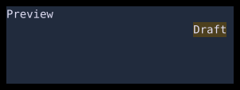

# Stack and Positioned

`Stack` overlays children in order, with the last child on top.



## [Example](../widgets/index.md#run-an-example)

```go
--8<-- "docs/widget-examples/layout/examples.go:stack"
```

## Behavior

- Unpositioned children use the stack's `Alignment`.
- Without an explicit size, non-positioned children determine the stack's intrinsic size.
- `Positioned` children do not contribute to that intrinsic size.
- `Positioned` uses optional `Top`, `Right`, `Bottom`, and `Left` offsets from the stack's border box.
- A nil edge leaves that edge unconstrained.
- Setting both left and right offsets stretches the child across the remaining width.
- Setting both top and bottom offsets does the same for height.
- `IntPtr(n)` supplies an edge offset.
- `PositionedAt(top, left, child)` sets the top and left offsets.
- `PositionedFill(child)` sets all four offsets to zero.

## Related

- [Floating](../floating.md)
