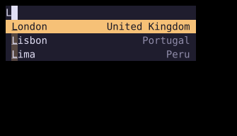

# Autocomplete

`Autocomplete` wraps a `TextInput` or `TextArea` with a list of suggestions.



## [Example](index.md#run-an-example)

```go
--8<-- "docs/widget-examples/inputs/examples.go:autocomplete"
```

## Behavior

- Create state once with `NewAutocompleteState` and reuse it across builds.
- `Child` must be a `TextInput` or `TextArea` value with its own state and a stable, nonempty `ID`.
- `State.SetSuggestions` replaces the available suggestions.
- `Suggestion.Label` is the displayed text, while `Value` is the inserted text.
- The built-in insertion strategies use `Label` when `Value` is empty.
- The input keeps focus while Up and Down move through visible suggestions.
- Enter or Tab accepts a visible suggestion, and Escape dismisses the popup.
- Selection updates the input, calls its `OnChange`, dismisses the popup, then calls `OnSelect`.
- `OnDismiss` also runs when selection dismisses the popup.
- The popup normally dismisses when the input loses focus.
- The example disables that behavior so the suggestions remain visible before the input receives focus.

## Triggers and matching

- Without `TriggerChars`, the query is the text before the cursor.
- With `TriggerChars`, the query starts after a trigger at the beginning of the text or after whitespace.
- `TriggerAnywhere` also permits a trigger inside a word.
- A triggered query ends at whitespace.
- `MinChars` sets the minimum query length for the popup.
- Matching defaults to `FilterContains`. `FilterFuzzy` enables fuzzy matching.
- The default insertion replaces the entire input without triggers, or replaces the trigger and query when triggers are configured.
- The `Insert` field accepts `InsertAtCursor`, `InsertReplaceWord`, or a custom `InsertStrategy`.
- `AnchorToInput` aligns the popup with the input content area and matches its width.
