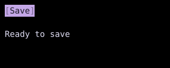

# Button

`Button` displays a label and calls `OnPress` when activated.



## [Example](index.md#run-an-example)

```go
--8<-- "docs/widget-examples/inputs/examples.go:button"
```

## Behavior

- A left click activates the button.
- Enter and Space activate the focused button through its keybindings.
- The optional `Click` callback receives mouse clicks after `OnPress` runs for a left click.
- `DisableFocus` prevents keyboard focus.
- The example changes the status text to Saved when you activate the button.

## Appearance

- `Variant` selects the default foreground and background colors from the theme.
- The variants are `ButtonDefault`, `ButtonPrimary`, `ButtonAccent`, `ButtonSuccess`, `ButtonError`, `ButtonWarning`, and `ButtonInfo`.
- `Style` accepts explicit colors and dimensions.
- While focused, the button uses the variant colors.
