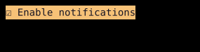

# Checkbox

`Checkbox` displays a checked or unchecked indicator with an optional label.



## [Example](index.md#run-an-example)

```go
--8<-- "docs/widget-examples/inputs/examples.go:checkbox"
```

## Behavior

- Create state once with `NewCheckboxState` and reuse it across builds.
- `NewCheckboxState` sets the initial checked value.
- Enter and Space toggle the focused checkbox.
- A mouse click also toggles the checkbox.
- `OnChange` receives the new value after the widget toggles its state.
- Calling `State.SetChecked` or `State.Toggle` updates the state without calling the widget's `OnChange` callback.
- `State.IsChecked()` reads the value without subscribing to changes.
- `State.Checked.Get()` subscribes when read during a tracked render phase.
- `DisableFocus` prevents keyboard focus.
- The example returns a pointer because `Checkbox` implements its widget methods with pointer receivers.
