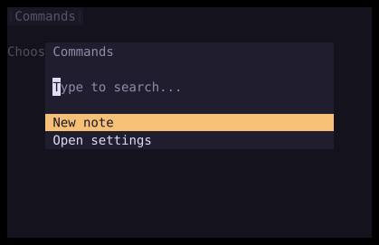

# CommandPalette

`CommandPalette` displays a searchable modal list of commands with optional nested levels.



## [Example](index.md#run-an-example)

```go
--8<-- "docs/widget-examples/inputs/examples.go:commandpalette"
```

## Behavior

- Create state once with `NewCommandPaletteState` and reuse it across builds.
- `State.Open()` shows the palette, and `State.Close()` hides it.
- Keep the palette in the widget tree while hidden so it can restore focus after closing.
- Selecting an item without `Children` calls its `Action`. The palette stays open unless your callback closes it.
- `OnSelect` overrides the default action and nested-level handling.
- Up and Down, or Ctrl+P and Ctrl+N, move between selectable items.
- Home and End choose the first and last selectable items.
- Enter chooses the current item.
- `OnCursorChange` receives the current selectable item after palette navigation or a query change.

## Searching

- Each level starts with fuzzy matching enabled.
- Fuzzy results are ranked by match score. Dividers disappear while the query contains non-whitespace characters.
- When the query contains non-whitespace characters, changing it moves the cursor to the first selectable result.
- When the query is empty or whitespace, the first selectable `Current: true` item receives the cursor, or the first selectable item if none is current.
- `FilterText` replaces the label as the search text, so it must include any label words you want to match.
- Matches through hidden keywords rank below comparable label matches.
- `State.CurrentLevel().FilterState.Mode.Set(FilterContains)` selects substring matching in the original item order.

## Nested levels and dismissal

- An item's `Children` callback supplies a new level when the item is selected.
- `ChildrenTitle` supplies the breadcrumb title, with the item label as its fallback.
- Each nested level starts with an empty query, and returning to a parent preserves the parent's query and cursor.
- Escape returns to the parent level or dismisses the palette at the root.
- Backspace on an empty query also returns to the parent unless `DisableBackspaceToPop` is set.
- An outside click dismisses the palette and calls `OnDismiss`.
- `Close()` resets the level stack, queries, and cursor, while `Close(true)` preserves them.
- Closing requests focus for the previous widget when it has an explicit ID, unless `SetNextFocusIDOnClose` supplies another ID.

## Positioning

- The palette defaults to the top center with a two-row inset.
- `AnchorID` positions the palette relative to a widget and takes precedence over `Position`.
- An anchored palette defaults to `AnchorBottomLeft` and uses `Offset` without the top inset.
