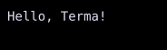

# Custom widgets

A custom widget implements `Build(ctx BuildContext) Widget`.



## [Example](index.md#run-an-example)

```go
--8<-- "docs/widget-examples/display/examples.go:custom-widgets"
```

## Behavior

- A composite widget returns other widgets from `Build()`.
- The example stores its input in the `Name` field and returns a `Text` widget.
- `BuildContext.Theme()` supplies the active theme.
- Signal reads in `Build()` subscribe that widget to rebuilds when the value changes.
- Update signals in handlers or setup code rather than during `Build()`.
- `SignalText` and the other [reactive text helpers](presentedtext.md) read changing text during painting.
- A leaf widget that draws its own content also implements `Renderable`.
- `ContainerLayoutBuilder` receives child layout nodes and returns the container layout node.

## Related

- The [layout overview](../layout/index.md) lists containers for arranging child widgets.
