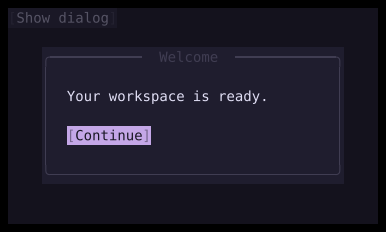

# Dialog

`Dialog` displays a centered modal overlay with content and action buttons.



## [Example](index.md#run-an-example)

```go
--8<-- "docs/widget-examples/inputs/examples.go:dialog"
```

## Behavior

- `Visible` controls whether the dialog registers an overlay.
- Keep the dialog in the widget tree with `Visible: false` when hidden so its next opening requests button focus again.
- `Content` accepts any widget.
- Buttons appear from left to right in a row aligned to the right.
- When the dialog becomes visible, it requests focus for the first button.
- Buttons without IDs receive IDs derived from the dialog ID and their index.
- The modal traps keyboard focus and places a backdrop behind its content.
- Escape calls `OnDismiss` when that callback is set.
- A backdrop click does not dismiss this dialog.
- Your callbacks control visibility, as the Continue button and `OnDismiss` do in the example.

## Appearance

- The default border is rounded, with `Title` centered in its top edge.
- The default width is 60 percent of the available width.
- Default padding is two cells horizontally and one cell vertically.
- `Style` overrides the default colors, border, padding, and width when those values are set.
