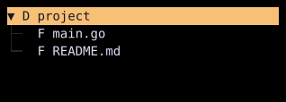

# DirectoryTree

`DirectoryTree` displays filesystem entries through `Tree[DirectoryEntry]`.



## [Example](index.md#run-an-example)

```go
--8<-- "docs/widget-examples/collections/examples.go:directorytree"
```

The first snippet browses the current directory, while the image and registered demo use the preloaded sample below.

```go
--8<-- "docs/widget-examples/collections/examples.go:directorytree-preview"
```

## Behavior

- `NewDirectoryTreeState` creates a single root, while `NewDirectoryTreeStateWithRoots` accepts multiple paths.
- The embedded `Tree` holds state, callbacks, filtering, selection, and scroll configuration.
- Expanding an unloaded directory reads its children in a goroutine.
- The default `ReadDir` uses `os.ReadDir`, while a custom function can provide entries from another source.
- Entries whose names start with a dot are excluded unless `IncludeHidden` is true.
- The default order puts directories first, then sorts names without case sensitivity.
- `Sort` replaces the default ordering.
- `EagerLoad` recursively loads unloaded descendants in the background and collapses newly loaded directories that have children.
- A read error appears as an error node.
- The default labels use `D` for directories, `F` for files, and `!` for errors.
- Filtering matches entry names, and node identifiers default to entry paths.
- Filtering searches only loaded nodes. `EagerLoad` makes descendants available to filtering as their directory reads complete.

## Related

- [Tree](tree.md) describes the shared navigation and selection behavior.
