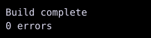

# EmptyWidget

`EmptyWidget` draws nothing and reports zero size.



## [Example](index.md#run-an-example)

```go
--8<-- "docs/widget-examples/layout/examples.go:empty"
```

## Behavior

- `ShowWhen(false, child)` returns `EmptyWidget{}`.
- `HideWhen(true, child)` returns the same empty placeholder.
- The example hides an error message and leaves the two visible lines adjacent.
- A parent's `Spacing` still applies between its children.
- `Spacer` provides an empty region with explicit or flexible dimensions.

## Related

- [Spacer](../layout/spacer.md)
