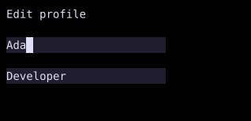

# FocusTrap

`FocusTrap` confines Tab navigation to its child subtree once a child has focus.



## [Example](index.md#run-an-example)

```go
--8<-- "docs/widget-examples/layout/examples.go:focustrap"
```

## Behavior

- `Active: true` enables trapping, and `ID` identifies the trap scope.
- An omitted `ID` uses an automatically generated scope ID.
- The wrapper delegates layout to `Child` and adds no border or padding.
- When `Active` is false, the wrapper adds no focus restriction of its own.
- Nested traps use the innermost active scope for their descendants.
- The example creates each text input state once, before the widget tree is built.

## Related

- [Floating](../floating.md)
- [TextInput](textinput.md)
