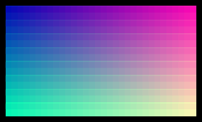

# Image

`Image` displays a decoded image through an `ImageResource`.



## [Example](index.md#run-an-example)

```go
--8<-- "docs/widget-examples/display/examples.go:image"
```

## Behavior

- `NewImageResource` copies source pixels into immutable NRGBA storage.
- Nil images and images with empty bounds return an error.
- The resource can be shared between widgets.
- A nil `Source` draws nothing.
- `ImageContain` is the default and centers the complete image while preserving its aspect ratio.
- `ImageCover` fills the box with a centered crop.
- `ImageStretch` fills the box without preserving the aspect ratio.
- `Style.Width` and `Style.Height` set the content box in terminal cells.

## Terminal output

- `TERMA_IMAGE_PROTOCOL` accepts `auto`, `kitty`, `sixel`, or `blocks`.
- Automatic detection chooses native output when the terminal capabilities permit it.
- Snapshots always contain the colored half-block representation.
- Native Kitty output also checks the linked Ultraviolet implementation for indexed-color support.

## Related

- The image demo exercises image fitting and overlays.

```sh
go run ./cmd/terma-browser -- go run ./cmd/image-demo
```
