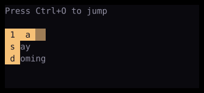

# Jumper

`Jumper` adds labeled keyboard targets to its child widget.



## [Example](index.md#run-an-example)

```go
--8<-- "docs/widget-examples/collections/examples.go:jumper"
```

The image and registered demo start with jump mode active through the preview function below.

```go
--8<-- "docs/widget-examples/collections/examples.go:jumper-preview"
```

## Behavior

- Create state once with `NewJumpState` and reuse it across builds.
- `NewJumpState` creates inactive jump state.
- Ctrl+O toggles jump mode by default, and `Key` changes this binding.
- `Targets` assigns fixed keys to widget IDs.
- A static target on a focusable widget moves focus to it, while a container target focuses its first focusable descendant.
- A target with an `Action` calls it instead of changing focus.
- Static keys can contain multiple characters, but one key must not prefix another.
- `Dynamic` adds hints to visible list items, tree nodes, table rows or cells, tabs, and other jump targets.
- A static target on a non-focusable `Jumpable` item invokes its jump behavior.
- Custom widgets implement `Jumpable` with a `Jump()` method.
- `Hints` supplies the characters for dynamic labels.
- Typing part of a label narrows the hints, and Backspace removes the last typed character.
- Escape, the toggle key, a click, or an unmatched key leaves jump mode.
- Only visible targets receive labels. When focus is inside a trap, jumps stay within that trap.
- `State.Activate()` enters jump mode programmatically.
- `State.IsActive()` and `State.Typed()` read reactive state.
- `LabelStyle` changes label styling, and `Backdrop` controls the tint behind labels.

## Related

- [Tabs](tabs.md) provides `TabBar.TabID` for targeting an individual tab.
