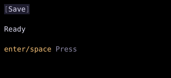

# KeybindBar

`KeybindBar` displays keybindings from the focused widget and its ancestors.



## [Example](index.md#run-an-example)

```go
--8<-- "docs/widget-examples/collections/examples.go:keybindbar"
```

## Behavior

- The bar updates when focus changes or reactive state read by `Keybinds` changes.
- Bindings with `Hidden` set are omitted.
- Among visible bindings, duplicate keys appear once, with the focused widget taking precedence over ancestors.
- Consecutive bindings with the same `Name` share one label, with their keys joined by `/`.
- Hints that do not fit are omitted from the end rather than truncated.
- The default width is `Flex(1)`, and the default height is one cell.
- `FormatKey` changes the displayed key names.
- Without a formatter, a literal space becomes `space`, and other keys keep their names.
- `Style` controls the bar's appearance.

## Related

- [Jumper](jumper.md) exposes its jump toggle in the keybinding bar.
