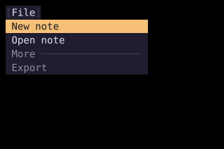

# Menu

`Menu` displays a floating list of actions with optional submenus, shortcut hints, and dividers.



## [Example](index.md#run-an-example)

```go
--8<-- "docs/widget-examples/inputs/examples.go:menu"
```

## Behavior

- `NewMenuState` stores the items and chooses the first selectable item.
- Up and Down, or `k` and `j`, move through selectable items and wrap at the ends.
- Home and End move to the first and last selectable items.
- Enter and Space select the current item.
- `Disabled` items and dividers cannot be selected.
- `Shortcut` displays a hint without registering a keybinding.
- An empty `MenuItem` creates a plain divider, while `Divider` adds a title.

## Submenus and dismissal

- Right or `l` opens the selected item's `Children` submenu.
- Selecting an item with children also opens its submenu.
- Left or `h` closes a submenu and returns focus to its parent. At the top level, it calls `OnDismiss`.
- For a leaf item, `OnSelect` overrides the item's `Action`.
- The menu stays in the widget tree until your application hides it.
- The example hides the menu after selection or dismissal and reopens it with the File button.
- Escape calls `OnDismiss`, and an outside click also calls it when supplied.
- `AnchorID` attaches the menu below a widget at `AnchorBottomLeft` unless `Anchor` is set.
- `Position` and `Offset` place a menu without an anchor.
