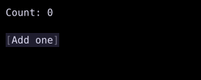

# PresentedText

`PresentedText` separates the text used for layout from the text drawn during painting.



## [Example](index.md#run-an-example)

```go
--8<-- "docs/widget-examples/display/examples.go:presentedtext"
```

## Behavior

- `SignalText` formats a `Signal` value during painting.
- Create the signal once and retain it across `Build()` calls, as the example factory does.
- `SignalText` uses the current formatted value as its layout text.
- `SignalMarkup` parses a formatted signal value as markup.
- `AnySignalText` and `AnySignalMarkup` provide the same behavior for `AnySignal` values.
- `ComputedText` and `ComputedSpans` use a callback for visible content and keep their layout based on the supplied `layoutText`.
- Signal reads in the paint callback subscribe to paint updates.
- With `LayoutStyle.Width` or `LayoutStyle.Height` explicitly set to `Auto`, a signal helper can request layout when its formatted content changes size.
- `PresentText` accepts a custom callback that returns content, spans, and style.

## Related

- For static content, [Text](text.md) accepts plain text and spans directly.
