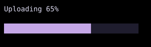

# ProgressBar

`ProgressBar` displays a horizontal bar with a progress value between zero and one.



## [Example](index.md#run-an-example)

```go
--8<-- "docs/widget-examples/display/examples.go:progressbar"
```

## Behavior

- `Progress: 0` draws an empty bar, and `Progress: 1` fills the bar.
- Values below zero or above one are clamped during rendering.
- The default width is `Flex(1)`, and the default height is `Cells(1)`.
- `Style.Width` and `Style.Height` override those defaults.
- `FilledColor` defaults to the theme primary color, and `UnfilledColor` defaults to the theme surface color.
- Partial blocks represent eighths of a terminal cell.
- The bar does not add a percentage label.

## Related

- The [animation guide](../animation.md) covers animated values for transitions between progress values.
