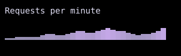

# Sparkline

`Sparkline` displays numeric values as a compact chart of Unicode bars.



## [Example](index.md#run-an-example)

```go
--8<-- "docs/widget-examples/display/examples.go:sparkline"
```

## Behavior

- `Values` contains the data points in display order.
- The default width matches the number of values, and the default height is one cell.
- A different width resamples the values to fit the available cells.
- When the width exceeds one cell, downsampling averages groups of values, and upsampling interpolates between values.
- At a width of one cell, the sparkline uses the final value.
- `MinValue` and `MaxValue` override the bounds calculated from the resampled values.
- `ColorByValue` enables a gradient from the theme muted text color to the primary color.
- `ValueColorScale` supplies a custom gradient and enables coloring by value.
- `Bars` replaces the default glyphs when it contains at least two entries.

## Related

- For a single completion value, [ProgressBar](progressbar.md) displays a filled horizontal bar.
