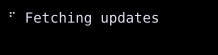

# Spinner

`Spinner` displays frames from a `SpinnerState`.



## [Example](index.md#run-an-example)

```go
--8<-- "docs/widget-examples/display/examples.go:spinner"
```

## Behavior

- `NewSpinnerState` creates the animation from a `SpinnerStyle`.
- `Start()` begins the animation, and `Stop()` stops it.
- Create and start the state once outside `Build()`, and retain it while the spinner is in use.
- Calling `Start()` before `Run()` schedules animation when the controller becomes available.
- The image shows one frame of the running example.
- Built-in styles include `SpinnerDots`, `SpinnerLine`, `SpinnerCircle`, and `SpinnerArrow`.
- A custom `SpinnerStyle` defines `Frames` and `FrameTime`.
- The frame list must contain at least one entry.
- Automatic width accommodates the widest frame.
- A label is a separate widget beside the spinner.

## Related

- The [animation guide](../animation.md) describes frame animations and other animation types.
