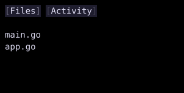

# Switcher

`Switcher` displays the child whose map key matches `Active`.



## [Example](index.md#run-an-example)

```go
--8<-- "docs/widget-examples/layout/examples.go:switcher"
```

## Behavior

- `Children` is a `map[string]Widget`.
- Inactive children are not built or rendered.
- An unknown `Active` key produces empty content.
- The example changes `Active` through button callbacks and a `Signal[string]`.
- State stored outside the switched child can be reused when that child becomes active again.
- `Style` supplies the container dimensions, padding, border, margin, and colors.

## Related

- [Tabs](tabs.md)
- [EmptyWidget](empty.md)
