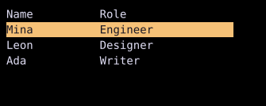
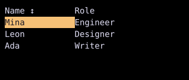

# Table

`Table` displays navigable rows and columns.



## [Example](index.md#run-an-example)

```go
--8<-- "docs/widget-examples/collections/examples.go:table"
```

## Rows and rendering

- `NewTableState` holds the rows, cursor, and selection.
- `Columns` defines each column width and optional header widget.
- `RenderHeader` supplies each header, with the column's `Header` as the fallback when the callback returns nil.
- The default renderer reads cells from slice or array rows.
- `RenderCell` receives the row, source row index, column index, and active and selected flags. A custom renderer controls the cell's appearance, including selection highlighting.
- `Filter` and `MatchCell` keep rows with a matching cell.
- `RenderCellWithMatch` receives the matching data for each cell and takes precedence over `RenderCell`.
- `CursorIndex` and row indices passed to renderers and matchers refer to `State.Rows`, even after filtering or sorting.
- `SetRows`, `Append`, `Prepend`, `InsertAt`, `RemoveAt`, `RemoveWhere`, and `Clear` update the data in `TableState`.

## Navigation and selection

- Up and Down, or `k` and `j`, move between visible rows. Home and End move to the first and last visible rows.
- `TableSelectionCursor` highlights a cell by default. `TableSelectionRow` highlights a row, and `TableSelectionColumn` highlights a column.
- Left and Right move between columns in cursor and column modes.
- With `MultiSelect`, Shift navigation and pointer selection extend the selection according to the selection mode.
- Enter and a double-click call `OnSelect(row T)`, or `ActivateOnClick` enables single-click activation.
- Selection keys depend on the mode: row indices, column indices, or `rowIndex * len(Columns) + colIndex` for cells.
- `SelectedRow()` returns the cursor row and a boolean indicating whether it exists. `SelectedRows()` is intended for row-selection mode.

## Row identity

- `NewTableState` tracks rows by position. `NewTableStateWithRowID(rows, rowID)` preserves the cursor and row or cell selections across `SetRows` when the same unique IDs remain.
- The ID function must return stable, nonempty, unique strings without side effects. Empty, duplicate, or removed IDs lose their selections, and a cursor that cannot be preserved is clamped.
- `SetRows` performs identity reconciliation. Calling `State.Rows.Set(...)` directly bypasses it.

## Sorting and column widths

This example uses names as unique row IDs and enables sorting, resizing, and a frozen header.



Run this example with `go run ./docs/widget-examples -widget table-controls`.

```go
--8<-- "docs/widget-examples/collections/examples.go:table-controls"
```

- Each sortable or resizable column needs a unique, nonempty `TableColumn.ID`.
- `Comparators` maps column IDs to functions that return a negative value, zero, or a positive value for two rows.
- Clicking a sortable header or pressing Ctrl+S cycles the current column through ascending, descending, and unsorted order.
- `State.Sort.Set(TableSort{ColumnID: "name", Direction: TableSortAscending})` sets the sort programmatically.
- Sorting changes the visible order without changing `State.Rows`. Filtering runs first, and equal comparator results retain source order.
- `TableSortNone` restores the filtered order, including fuzzy-match ranking when enabled.
- `Resizable` enables dragging the rightmost cell of a column header and Ctrl+Left or Ctrl+Right on the current column. Ctrl+R restores its configured width.
- `MinWidth` and `MaxWidth` constrain resized widths in cells. The minimum is at least one cell, and a zero maximum means unlimited.
- `State.ColumnWidths` stores width overrides by column ID.

## Scrolling

- A shared `ScrollState` connects a regular table to a surrounding `Scrollable` for cursor visibility.
- `FrozenHeader` keeps headers visible, and `FrozenColumns` keeps the first N columns visible during horizontal scrolling.
- Either frozen option gives the table its own viewport. A bounded `Style.Width` and `Style.Height` define its visible area without a surrounding `Scrollable`.
- The built-in viewport uses the supplied `ScrollState`, or an internal one when none is supplied. Alt+Left and Alt+Right pan horizontally by three cells.

## Related

- [List](list.md) displays one item per row without column definitions.
