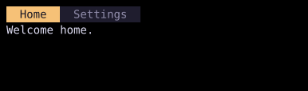

# Tabs

`TabBar` displays horizontal tabs, and `TabView` adds the active tab's content below the bar.



## [Example](index.md#run-an-example)

```go
--8<-- "docs/widget-examples/collections/examples.go:tabs"
```

## Behavior

- `TabState` stores the tabs and the active key.
- `NewTabState` activates the first tab when the list is nonempty.
- Each `Tab` has a unique `Key`, a visible `Label`, and optional `Content`.
- `TabBar` ignores `Content`, while `TabView` uses it for the selected view.
- Left and Right, or `h` and `l`, select adjacent tabs and wrap at the ends.
- `KeybindPattern` supports plain, Alt, or Ctrl number keys for the first nine tabs. The default, `TabKeybindNone`, disables number shortcuts.
- Clicking a tab activates it.
- `Closable` adds close buttons and Ctrl+W.
- If `OnTabClose` is set, it handles closure instead of the bar calling `RemoveTab`.
- `AllowReorder` enables Ctrl+H and Ctrl+L to move the active tab.
- `AddTab`, `InsertTab`, `RemoveTab`, and `SetLabel` update tabs through `TabState`.
- `TabStyle` and `ActiveTabStyle` customize the inactive and active tabs.
- `TabView.ContentStyle` styles the content area.

## Related

- [Switcher](switcher.md) displays content selected by a string key.
