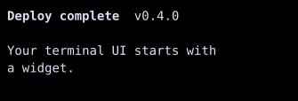

# Text

`Text` displays plain text or a sequence of styled spans.



## [Example](index.md#run-an-example)

```go
--8<-- "docs/widget-examples/display/examples.go:text"
```

## Behavior

- `Content` supplies plain text, and nonempty `Spans` take precedence.
- `WrapNone` is the default and clips lines at the available width.
- `WrapSoft` wraps at word boundaries and breaks words that exceed the available width.
- `WrapHard` breaks lines at the available width.
- `TextAlignLeft`, `TextAlignCenter`, and `TextAlignRight` position each line within the available width.
- `Style` sets dimensions, colors, padding, borders, and text decoration.
- Span styles can override the base text style.
- A span with `Style.Link` set is a [terminal hyperlink](../hyperlinks.md).

## Related

- For changing values, [PresentedText](presentedtext.md) provides reactive text helpers.
