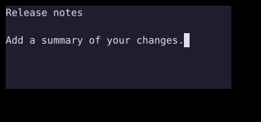

# TextArea

`TextArea` edits multiple lines with cursor movement, selection, and configurable wrapping.



## [Example](index.md#run-an-example)

```go
--8<-- "docs/widget-examples/inputs/examples.go:textarea"
```

## Behavior

- Create state once with `NewTextAreaState` and reuse it across builds.
- `NewTextAreaState` stores the initial text, places the cursor at its end, and enables soft wrapping.
- `Style.Width` and `Style.Height` set the content dimensions.
- `State.GetText()` reads the current text without subscribing to changes.
- `State.SetText()` replaces the text and clamps the cursor without calling `OnChange`.
- Enter inserts a newline while editing is enabled.
- Ctrl+Enter calls `OnSubmit` when that callback is set.
- `OnChange` receives the text after edits handled by the widget.

## Navigation and selection

- Arrow keys move the cursor, and Shift with an arrow key extends the selection.
- Home and End move to the boundaries of the current newline-delimited line, while Ctrl+Left and Ctrl+Right move by word.
- Ctrl+A selects all text.
- A double click selects a word, and a triple click selects a line.
- `State.ReadOnly` blocks user edits while movement and selection remain available.
- With `RequireInsertMode: true`, Escape leaves insert mode, and I or Enter re-enters it.
- New state starts in insert mode. Set `State.InsertMode.Set(false)` during setup to start in navigation mode.

## Wrapping and search

- `State.WrapMode` supports `WrapNone`, `WrapSoft`, and `WrapHard`.
- `State.ToggleWrap()` changes `WrapNone` to `WrapSoft`, and either wrapping mode to `WrapNone`.
- `State.SearchQuery` highlights text matches, with case sensitivity controlled by `State.SearchCaseSensitive`.
- `ExtraKeybinds` precede default bindings, and `OnPaste` can consume a paste by returning `true`.
