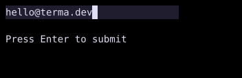

# TextInput

`TextInput` edits one line of text with cursor movement, selection, and horizontal scrolling.



## [Example](index.md#run-an-example)

```go
--8<-- "docs/widget-examples/inputs/examples.go:textinput"
```

## Behavior

- Create state once with `NewTextInputState` and reuse it across builds.
- `NewTextInputState` stores the initial text and places the cursor at its end.
- `State.GetText()` reads the current text without subscribing to changes.
- `State.SetText()` replaces the text and clamps the cursor without calling `OnChange`.
- `OnChange` receives text after edits handled by the widget.
- Enter calls `OnSubmit` while the input is editable.
- `Placeholder` appears when the text is empty.
- The content height is always one cell, with border and padding added outside it.

## Keyboard and selection

- Left and Right move by one grapheme, while Home and End move to the beginning and end.
- Ctrl+Left and Ctrl+Right move by word.
- Shift with these movement keys extends the selection.
- Ctrl+A selects all text.
- Without a selection, Backspace deletes before the cursor, and Delete removes the grapheme at the cursor.
- Without a selection, Ctrl+U deletes to the beginning, Ctrl+K deletes to the end, and Ctrl+W deletes the previous word.
- `ExtraKeybinds` precede the default bindings.
- `State.ReadOnly` blocks user edits while cursor movement and selection remain available.
- `OnPaste` can consume pasted text by returning `true`.
