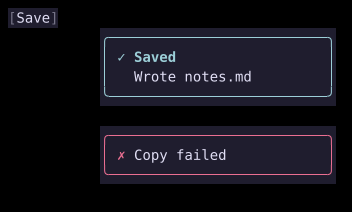

# Toasts

`Toasts` shows short notifications stacked in a corner of the screen. A `ToastState` holds them, and any code with the state can add one.



## [Example](index.md#run-an-example)

```go
--8<-- "docs/widget-examples/display/examples.go:toasts"
```

## Adding toasts

- `NewToastState(ToastOptions{})` creates the queue. Create it once, outside `Build()`.
- `Notify(Toast{...})` adds a toast and returns its `ToastID`.
- `Info`, `Success`, `Warning`, and `Error` add a toast with only a message.
- A `Toast` has a `Message`, an optional bold `Title`, a `Severity`, and a `Timeout`.
- The severity sets the icon and the theme color of the border and title: `Info`, `Success`, `Warning`, or `Error`.
- `Dismiss(id)` removes one toast. `Clear()` removes all of them.
- Every `ToastState` method is safe to call from any goroutine, including a [Task](../async.md) or a ticker. No `Dispatch` is needed.

## Timeouts and the queue

- `ToastOptions.MaxVisible` sets how many toasts are on screen at once. The default is 3.
- Later toasts wait in arrival order, and a muted `+N more` line counts them.
- A toast's timeout starts when it appears on screen, so a waiting toast still gets its full time.
- `ToastOptions.Timeout` sets the default timeout. The default is 4 seconds.
- `Toast.Timeout` overrides the default for one toast. A negative value keeps the toast until it is dismissed.
- Timeouts use one timer per toast on screen. They do not run the animation ticker, and an expiry rebuilds only the toast overlay.

## The Toasts widget

- Place `Toasts{State: state}` anywhere in the tree. It takes no layout space and registers a [Floating](../floating.md) overlay while toasts are on screen.
- `Position` selects the corner or edge: one of the top or bottom `FloatPosition` values. The default is `FloatPositionBottomRight`. The stack sits one cell in from the screen edges.
- `Width` sets each toast's width in cells, including its border. The default is 40. Messages wrap to fit.
- Clicking a toast dismisses it.
- While the pointer is over a toast, its timeout is held and its background changes to `SurfaceHover`. The remaining time resumes when the pointer leaves.
- The overlay is not modal and takes no keyboard focus.

## Related

- [Floating](../floating.md)
- [Async tasks](../async.md)
