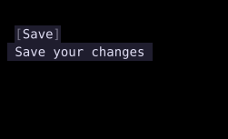

# Tooltip

`Tooltip` shows contextual text when its child is hovered or focused.



## [Example](index.md#run-an-example)

```go
--8<-- "docs/widget-examples/layout/examples.go:tooltip"
```

## Behavior

- `Content` supplies plain text, while nonempty `Spans` take precedence.
- `Position` accepts `TooltipTop`, `TooltipBottom`, `TooltipLeft`, or `TooltipRight`.
- The default position is above the child.
- `Offset` sets the gap in cells and defaults to zero.
- `Style` overrides the tooltip text's appearance.
- Without color overrides, the tooltip uses the theme's surface and text colors.
- When all padding fields are zero, the tooltip adds one cell on each horizontal side.
- An omitted `ID` uses an automatically generated anchor ID.
- A nil child or a disabled context prevents the tooltip from appearing.

## Related

- [Floating](../floating.md)
